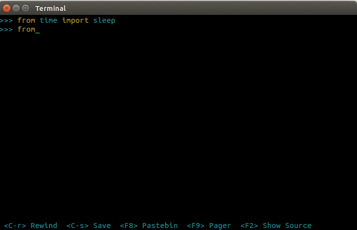

# tqdm

[](https://travis-ci.org/tqdm/tqdm)
[](https://coveralls.io/r/tqdm/tqdm)

tqdm (read ta<i>qa</i>dum, تقدّم) means "progress" in arabic.

Instantly make your loops show a progress meter - just wrap any iterable with
"tqdm(iterable)", and you're done! Here's what the output looks like:

 76%|████████████████████` ` ` ` ` ` | 7641/10000 [00:34<00:10, 222.22 it/s]

You can also use `trange(N)` as a shortcut for `tqdm(xrange(N))`



Overhead is low -- about 55ns per iteration. By comparison, our esteemed
competition, [ProgressBar](https://code.google.com/p/python-progressbar/), has
an 878ns/iter overhead. It's a matter of taste, but we also like to think our
version is much more visually appealing.

## Installation

```sh
# newer, faster, prettier, stable version
pip install -e git+https://github.com/tqdm/tqdm.git#egg=tqdm
# or (old version on pypi)
pip install tqdm
```

## Documentation

```python
def tqdm(iterable, desc=None, total=None, leave=False, file=sys.stderr,
         ncols=None, mininterval=0.1, miniters=None, ascii=None, disable=False):
    """
    Decorate an iterable object, returning an iterator which acts exactly
    like the orignal iterable, but prints a dynamically updating
    progressbar.

    Parameters
    ----------
    iterable  : iterable
        Iterable to decorate with a progressbar.
    desc  : str, optional
        Prefix for the progressbar.
    total  : int, optional
        The number of expected iterations. If not given, len(iterable) is
        used if possible. As a last resort, only basic progress statistics
        are displayed.
    file  : `io.TextIOWrapper` or `io.StringIO`, optional
        Specifies where to output the progress messages.
        Uses file.write(str) and file.flush() methods.
    leave  : bool, optional
        if unset, removes all traces of the progressbar upon termination of
        iteration [default: False].
    ncols  : int, optional
        The width of the entire output message. If sepcified, dynamically
        resizes the progress meter [default: None]. The fallback meter
        width is 10.
    mininterval  : float, optional
        Minimum progress update interval, in seconds [default: 0.1].
    miniters  : int, optional
        Minimum progress update interval, in iterations [default: None].
    ascii  : bool, optional
        If not set, use unicode (▏▎▋█ █) to fill the meter
        [default: False]. The fallback is to use ASCII characters (1-9 #).
    disable : bool
        Disable the progress bar if True [default: False].

    Returns
    -------
    out  : decorated iterator.
    """

def trange(*args, **kwargs):
    """
    A shortcut for tqdm(xrange(*args), **kwargs).
    On Python3+ range is used instead of xrange.
    """
```

## Contributions

To run the testing suite please make sure tox (http://tox.testrun.org/)
is installed, then type `tox` from the command line.

Alternatively if you don't want to use `tox`, a Makefile is provided with the
following command:

```sh
$ make flake8
$ make test
$ make coverage
```

## License

[MIT LICENSE](LICENSE).


## Authors

- noamraph (original author)
- JackMc
- arkottke
- obiwanus
- fordhurley
- kmike
- hadim
- casperdcl
